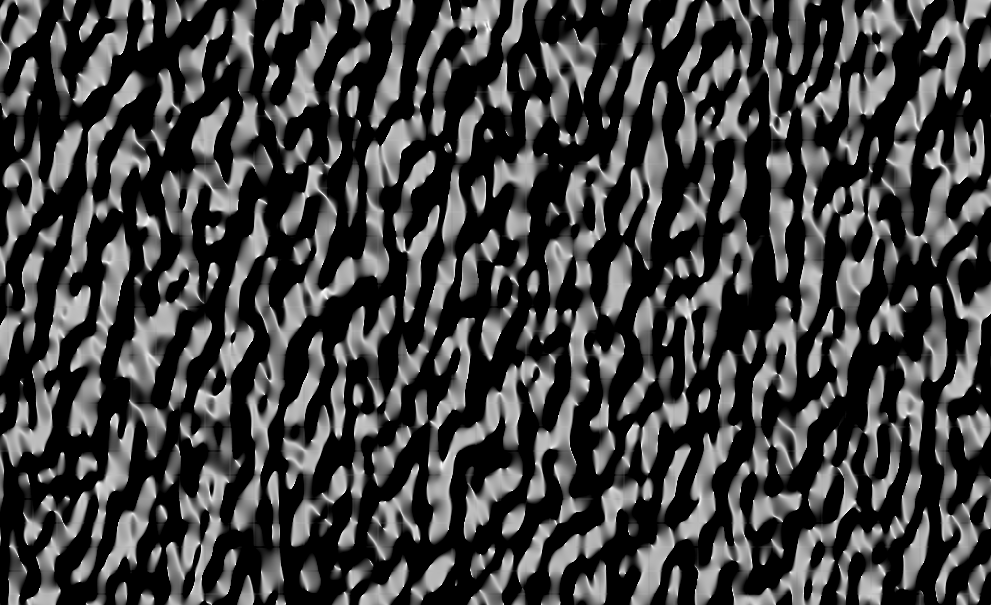

# Random DEM Generator

Honestly the outputs still look a bit ropey - would love some interesting patches to make
the DEM's produced look more natural.

## Setup

Make sure you have GDAL and GDAL Python bindings installed.

You need these pip packages:

```
pip3 install numpy scipy
```

## Usage

```
./random_dem.py
```

## Sample Output




## Issues

The GDAL Georeferencing is still broken so it does not open nicely in QGIS.

## Credits

Assembled by Tim Sutton and Vctoria Neema
2021

## License

Unknown, heavily derived from these two sources:

http://www2.geog.ucl.ac.uk/~plewis/geogg122-2011-12/dem1.html

and

https://gis.stackexchange.com/questions/290776/how-to-create-a-tiff-file-using-gdal-from-a-numpy-array-and-specifying-nodata-va
